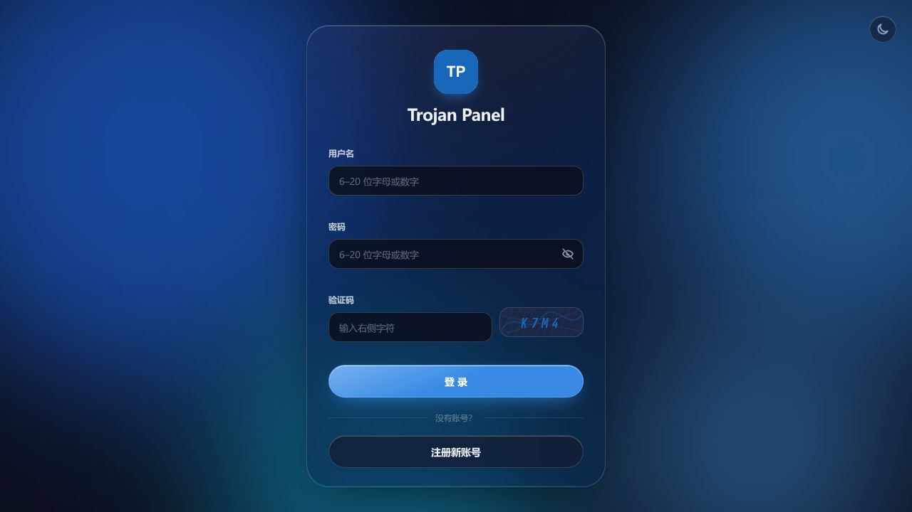
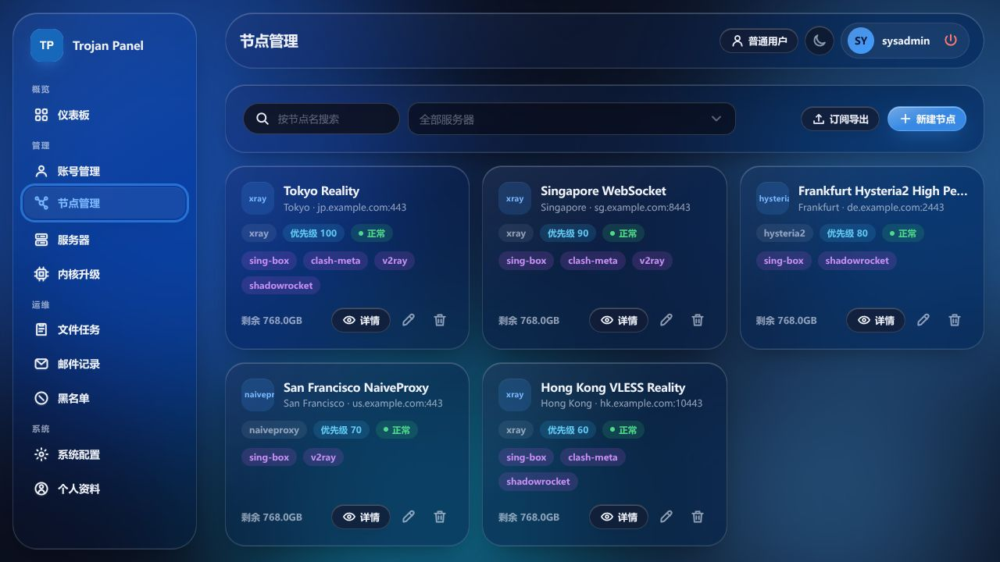
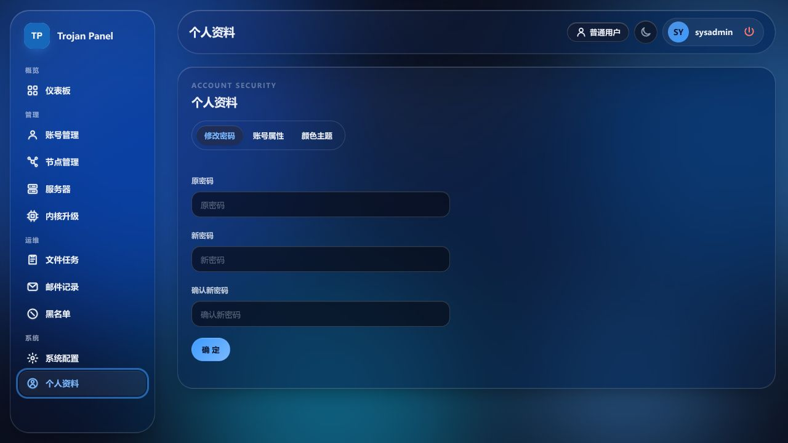

# TrojanPanel Next Web UI

简体中文 | [English](README_EN.md)

TrojanPanel Next 的响应式 Web 管理界面，提供管理员与普通用户页面，使用统一的磨砂玻璃主题，适配桌面和手机浏览器。

## 功能

- 管理用户、节点服务器、Xray / Hysteria2 / NaiveProxy 代理节点和订阅。
- 查看用户及服务器流量，管理 Xray 与 Hysteria2 内核任务。
- 通过服务器移除弹窗选择“删除”（仅清 Web 记录）、“卸载”（保留 Node 数据）或“彻底卸载”；失联服务器也可仅删除 Web 记录。
- 亮色、暗色主题跟随浏览器，支持海蓝、紫罗兰、翡翠和琥珀调色板。
- 桌面侧栏、移动导航、表格、表单、弹窗和加载状态使用统一控件。

## 部署

使用 [v1.0.2-rc.6 脚本入口](../../../scripts/README.md)安装 Web。完整操作见[部署指南](../../../docs/deployment.md#web)，已有部署通过[镜像更新命令](../../../docs/deployment.md#updates)更新。

## 界面







## 本地开发

要求 Node.js `^20.19.0 || >=22.12.0` 和 Yarn Classic 1.22，在本目录执行：

```bash
npx --yes yarn@1.22.22 install --frozen-lockfile
npm run serve
```

开发地址为 `http://127.0.0.1:8888/`，API 默认代理至 `http://127.0.0.1:8081/`。Vue 2.7、Vite 与内部 UI 包的构建、模拟 API 和浏览器测试见[开发指南](../../../docs/development.md)。

## 构建

```bash
npm run build
```

构建输出到 `dist/`，可由项目 Web 镜像或 Nginx 承载。`VITE_BASE_API` 配置客户端 API 前缀，默认 `/api`。
