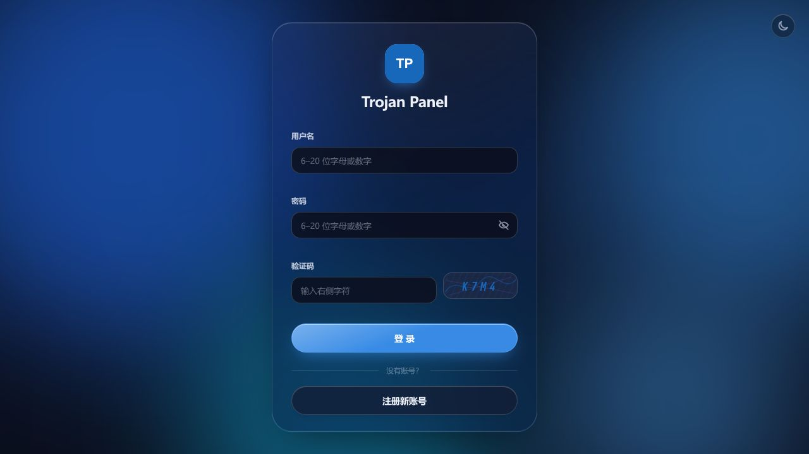
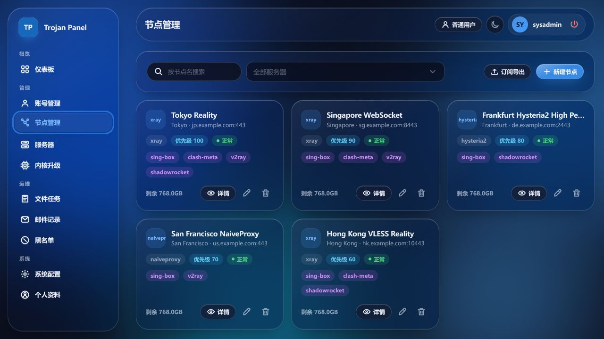
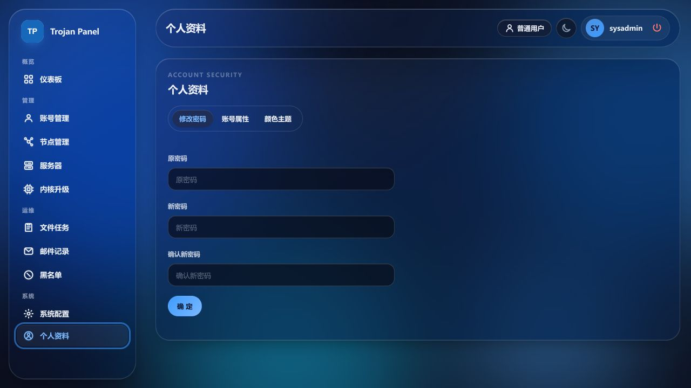

# TrojanPanel Next Web UI

[简体中文](README.md) | English

The responsive Web administration interface for TrojanPanel Next. It uses a consistent frosted-glass design across administrator and user pages on desktop and mobile browsers.

## Highlights

- Light and dark themes follow browser preferences on first load and react to preference changes.
- Blue, violet, emerald, and amber palettes are saved in the current browser.
- The page theme color is synchronized with supported mobile browsers.
- Desktop and mobile navigation share the same icons and state styles.
- Tables, forms, date pickers, overlays, dialogs, and loading states use common controls.
- Responsive administrator and regular-user views are included.

Browser chrome colors depend on browser and operating-system support. Some browsers require an option similar to “follow page color.”

## Test page previews

### Login



### Nodes



### Profile



## Local development

Use Node.js `^20.19.0 || >=22.12.0` (Node 22 recommended) and Yarn Classic 1.22. The application uses Vue 2.7.16, Vite 7, and the official `@vitejs/plugin-vue2`.

```bash
npx --yes yarn@1.22.22 install --frozen-lockfile
npm run serve
```

The default development URL is `http://127.0.0.1:8888/`, and API requests are proxied to `http://127.0.0.1:8081/`.

Run the included mock API and UI server for local testing:

```bash
MOCK_API_PORT=18081 node tests/mock-api-server.js
MOCK_API_TARGET=http://127.0.0.1:18081 npm run serve -- --port 18888
```

## Build and test

```bash
npm run lint -- --no-fix
npm run test:ui-libraries
npm run test:ui-cleanup
npm run test:vite-proxy
npm run build:ui-labs
npm run build
npm run test:live-stack:e2e
```

`test:live-stack:e2e` uses only the local mock account and captcha fixtures. The production build is written to `dist/` and can be deployed with Nginx or the project Docker image.

## Support

- [Original TrojanPanel project](https://github.com/trojanpanel)
- [trojan](https://github.com/trojan-gfw/trojan)
- [trojan-go](https://github.com/p4gefau1t/trojan-go)
- [Xray-core](https://github.com/XTLS/Xray-core)
- [hysteria](https://github.com/HyNetwork/hysteria)
- [naiveproxy](https://github.com/klzgrad/naiveproxy)
